# Diagrama de Clases - SGEMD

Sistema de Gestión de Emprendimiento Minuto de Dios. Diagrama de clases del
**núcleo de dominio** del MVP: entidades con sus atributos, visibilidad,
métodos y multiplicidades.

> **Complementa a `component-diagram.mmd`**, no lo reemplaza. El diagrama de
> componentes muestra *dónde vive cada pieza* (frontend, backend, middleware,
> PostgreSQL). Las clases muestran *cómo se estructura el negocio por dentro*.
> Junto con `context-diagram.mmd` completan la familia de diagramas del MVP.

## Procedencia y método

| Aspecto | Detalle |
| ------- | ------- |
| **Fuente de verdad** | `README.md` §5 *Modelo de datos*, §6 *Decisiones*, §7 *API* (versión `origin/main`, motor PostgreSQL 17) |
| **Contraste con** | `docs/fr_nfr_sgemd.md`, `docs/historias_usuario.md`, `docs/component-diagram.mmd` |
| **Herramienta** | Mermaid (`classDiagram`) + draw.io |
| **Validación** | 18 clases, 27 relaciones, renderizado en `mermaid-cli` y verificado sin cajas superpuestas |

**Decisión de diseño:** los nombres de los atributos son **idénticos a las
columnas del modelo físico**. No se renombraron a nombres "limpios" porque
cualquier divergencia entre el diagrama y la tabla terminaría siendo un bug de
mapeo (el `README.md` §10 ya registra como error histórico del proyecto anterior
justo eso: *"joins que usaban columnas inexistentes"*).

---

## Diagrama (Mermaid)

```mermaid
classDiagram
    direction TB

    class Usuario {
        -idUsuarios: int
        -nombre: string
        -correoInstitucional: string
        -correoPersonal: string
        -password: string
        -verificado: boolean
        -estado: boolean
        -celular: string
        -telefono: string
        -direccion: string
        -genero: string
        -estadoCivil: string
        -fechaNacimiento: date
        -semestre: int
        -imgPerfil: string
        -fechaCreacion: datetime
        -fechaActualizacion: datetime
        +registrar(): Usuario
        +verificarCorreo(codigo: string): boolean
        +iniciarSesion(): Token
        +cerrarSesion(): void
        +consultarPerfil(): Usuario
        +editarPerfil(): Usuario
        +subirAvatar(archivo: Adjunto): void
        +desactivar(): void
        +reactivar(): void
        +esAdministrador(): boolean
        +esDocente(): boolean
        +esEstudiante(): boolean
    }

    class Emprendimiento {
        -idEmprendimiento: int
        -nombre: string
        -descripcion: string
        -tipoEmprendimiento: string
        -sectorProductivo: string
        -redesSociales: string
        -acompanamiento: string
        -actaCompromiso: string
        -fechaCreacion: datetime
        -fechaActualizacion: datetime
        +crear(): Emprendimiento
        +editar(): Emprendimiento
        +eliminar(): void
        +consultarPorAlcance(usuario: Usuario): Emprendimiento[]
        +cambiarEtapa(etapa: EtapaEmprendimiento): void
        +esParalelo(): boolean
        +registrarActa(archivo: Adjunto): void
    }

    class Asignacion {
        -idAsignacion: int
        -fechaAsignacion: date
        -estado: boolean
        +crear(): Asignacion
        +reasignar(mentor: Usuario): Asignacion
        +desactivar(): void
        +consultarPorMentor(): Asignacion[]
        +consultarPorEstudiante(): Asignacion[]
        +estaActiva(): boolean
        +validarUnicaActivaPorEmprendimiento(): boolean
    }

    class Seguimiento {
        -idSeguimientos: int
        -descripcion: string
        -tipoSeguimiento: string
        -fechaCreacion: datetime
        -fechaActualizacion: datetime
        +registrar(autor: Usuario): Seguimiento
        +editar(autor: Usuario): Seguimiento
        +eliminar(autor: Usuario): void
        +consultarHistorialPorEmprendimiento(): Seguimiento[]
        +adjuntarEvidencia(archivo: Adjunto): void
    }

    class Tarea {
        -idTareas: int
        -titulo: string
        -descripcion: string
        -fechaLimite: date
        -estado: string
        -fechaCreacion: datetime
        -fechaActualizacion: datetime
        +crear(): Tarea
        +editar(): Tarea
        +eliminar(): void
        +completar(): void
        +marcarVencida(): void
        +consultarMisTareas(): Tarea[]
        +calcularAvance(): decimal
        +adjuntarEvidencia(archivo: Adjunto): void
    }

    class Asesoria {
        -idAsesorias: int
        -nombreDeAsesoria: string
        -descripcion: string
        -fechaAsesoria: date
        -comentarios: string
        -confirmacion: string
        -fechaCreacion: datetime
        -fechaActualizacion: datetime
        +solicitar(estudiante: Usuario): Asesoria
        +confirmar(docente: Usuario): Asesoria
        +editar(autor: Usuario): Asesoria
        +eliminar(autor: Usuario): void
        +consultarPorAlcance(usuario: Usuario): Asesoria[]
        +estaPendiente(): boolean
        +adjuntarEvidencia(archivo: Adjunto): void
    }

    class Diagnostico {
        -idDiagnosticos: int
        -fechaEmprendimiento: date
        -indicadores: json
        -fortalezas: string
        -oportunidadesMejora: string
        +generar(): Diagnostico
        +editar(): Diagnostico
        +eliminar(): void
        +consultarPorEmprendimiento(): Diagnostico[]
        +calcularMetricas(): Diagnostico
    }

    class Evento {
        -idEventos: int
        -nombreEvento: string
        -descripcionEvento: string
        -capacidadMaxima: int
        -estado: boolean
        -requiereRegistro: boolean
        -fechaCreacion: datetime
        -fechaActualizacion: datetime
        +crear(): Evento
        +editar(): Evento
        +listar(): Evento[]
        +registrarAsistencia(usuario: Usuario, estado: string): void
        +desregistrar(usuario: Usuario): void
        +hayCupo(): boolean
    }

    class InscripcionEvento {
        -estadoAsistencia: string
        +marcarAsistencia(estado: string): void
    }

    class CodigoVerificacion {
        -idCodigo: int
        -correoInstitucional: string
        -codigo: string
        -expiracion: datetime
        -usado: boolean
        +generar(correo: string): CodigoVerificacion
        +estaVencido(): boolean
        +marcarUsado(): void
    }

    class Adjunto {
        <<propuesta>>
        -idAdjunto: int
        -nombreArchivo: string
        -rutaArchivo: string
        -tamanioBytes: long
        -tipoMime: string
        -fechaSubida: datetime
        +subir(archivo): Adjunto
        +descargar(): Archivo
        +eliminarDelServidor(): void
    }

    class Rol {
        <<catalogo>>
        -idRoles: int
        -nombre: string
    }

    class EtapaEmprendimiento {
        <<catalogo>>
        -idEtapaEmprendimiento: int
        -tipoEtapa: string
    }

    class Modalidad {
        <<catalogo>>
        -idModalidad: int
        -nombre: string
    }

    class FechaHorario {
        <<bloque>>
        -idFecha_y_Horarios: int
        -fecha: date
        -horaInicio: time
        -horaFin: time
        +estaDisponible(): boolean
    }

    class SectorEconomico {
        <<catalogo>>
        -idSectorEconomico: int
        -nombre: string
    }

    class TipoEvento {
        <<catalogo>>
        -idTipo_evento: int
        -nombre: string
    }

    class Modulo {
        <<catalogo>>
        -idModulos: int
        -nombre: string
        +estaHabilitadoPara(usuario: Usuario): boolean
    }

    Usuario "0..*" --> "1" Rol : tiene
    Usuario "0..*" --> "0..1" Modulo : habilitado por

    Usuario "1" --> "0..*" Emprendimiento : es propietario de
    EtapaEmprendimiento "1" --> "0..*" Emprendimiento : clasifica

    Usuario "1" --> "0..*" Asignacion : mentor
    Usuario "1" --> "0..*" Asignacion : estudiante
    Emprendimiento "0..1" --> "0..*" Asignacion : vincula

    Emprendimiento "1" --> "0..*" Seguimiento : registra
    Usuario "1" --> "0..*" Seguimiento : es autor de

    Emprendimiento "1" --> "0..*" Tarea : planifica
    Usuario "1" --> "0..*" Tarea : estudiante asignado
    Usuario "0..1" --> "0..*" Tarea : docente creador

    Usuario "1" --> "0..*" Asesoria : estudiante solicita
    Usuario "0..1" --> "0..*" Asesoria : docente confirma
    Modalidad "1" --> "0..*" Asesoria : modalidad
    FechaHorario "0..1" --> "0..*" Asesoria : ocupa

    Emprendimiento "1" --> "0..*" Diagnostico : evalua
    SectorEconomico "1" --> "0..*" Diagnostico : sector

    TipoEvento "1" --> "0..*" Evento : tipifica
    Modalidad "1" --> "0..*" Evento : modalidad
    FechaHorario "1" --> "0..*" Evento : programa
    Evento "1" --> "0..*" InscripcionEvento : convoca
    Usuario "0..*" --> "0..*" InscripcionEvento : participa

    Usuario "1" --> "0..*" CodigoVerificacion : solicita por correo

    Seguimiento "0..*" --> "0..*" Adjunto : evidencia
    Tarea "0..*" --> "0..*" Adjunto : evidencia
    Asesoria "0..*" --> "0..*" Adjunto : evidencia
```

---

## Catálogos de perfil

Se listan aparte porque **no tienen comportamiento**: son tablas de lectura que
solo aportan una clave foránea a `Usuario`. Modelarlas como clases sin métodos
añadiría cajas vacías al diagrama sin aportar información.

| Catálogo | PK | Se usa en |
| -------- | -- | --------- |
| `roles` | `idRoles` | `Usuario` (1→N) — 1=Admin, 2=Estudiante, 3=Docente |
| `tipodocumentos` | `idTipoDocumento` | `Usuario` (tipo de documento) |
| `tipousuarios` | `idTipoUsuarios` | `Usuario` (Estudiante/Egresado/Docente/Administrativo) |
| `programaacademico` | `idProgramaAcademico` | `Usuario` (semestre/carrera) |
| `centrouniversitarios` | `idCentroUniversitarios` | `Usuario` (campus) |
| `municipios` | `idMunicipio` | `Usuario` (municipio de residencia) |
| `tipopoblacion` | `idTipoPoblacion` | `Usuario` (población vulnerable) |
| `modulos` | `idModulos` | `Usuario` (0..1) — sí aparece en el diagrama por tener método |

---

## Capa de servicios: qué clase responde por qué requisito

Cada clase del diagrama se materializa en el backend como un servicio
(`routes → controllers → services → BD`, según `component-diagram.mmd`).

| Servicio | Clases del diagrama que opera | Requisito / regla que obliga |
| -------- | ----------------------------- | ----------------------------- |
| `AuthService` | `Usuario`, `CodigoVerificacion` | FR-001, R1, R2 · OTP 8 dígitos / 5 min |
| `UserService` | `Usuario`, `Rol`, `Modulo` | FR-002 (usuarios y roles) · R3 |
| `EmprendimientoService` | `Emprendimiento`, `EtapaEmprendimiento` | FR-004, FR-010 · R4–R8 · R17 (4 etapas) |
| `AsignacionService` | `Asignacion`, `Usuario`, `Emprendimiento` | FR-004 · R9–R11 (una activa por emprendimiento) |
| `SeguimientoService` | `Seguimiento`, `Emprendimiento`, `Usuario` | FR-006 · R12–R16 (autor obligatorio) |
| `TareaService` | `Tarea`, `Emprendimiento`, `Usuario` | FR-007 · R18–R21 (avance derivado de BD) |
| `AsesoriaService` | `Asesoria`, `FechaHorario`, `Modalidad` | FR-004, FR-005 · R22–R23 · BR-002 |
| `DiagnosticoService` | `Diagnostico`, `SectorEconomico` | FR-002 (diagnóstico automático) |
| `EventoService` | `Evento`, `InscripcionEvento`, `TipoEvento` | FR-005 (registro y asistencia manual) |
| `DashboardService` | `Usuario`, `Emprendimiento`, `Tarea` | FR-010 (métricas reales, no mock) |
| `AdjuntoService` | `Adjunto` (propuesta) | FR-008 (500 MB, se borra con el registro) |

---

## Revisión crítica: 5 problemas detectados al contrastar con los requisitos

Este es el resultado de validar el modelo contra las historias y las reglas de
negocio, **no** de aceptar el primer borrador. La IA no detecta estos problemas:
solo aparecen al cotejar el diagrama contra el documento de requisitos.

| # | Problema | Corrección propuesta | Justificación (regla / requisito afectado) |
| - | -------- | -------------------- | ------------------------------------------ |
| 1 | **`asesorias` no tiene relación con `emprendimiento`.** El expediente central del proyecto no puede incluir las asesorías. | Agregar `Emprendimiento_idEmprendimiento` a `asesorias` y la relación `Emprendimiento "1" --> "0..*" Asesoria`. | FR-006: *"anclar todo el historial de diagnósticos, notas de seguimiento, tareas **y asesorías** directamente a la entidad Emprendimiento"*. En `transcription_2.md` la coordinadora lo pide explícito para que el asesor nuevo vea el contexto. |
| 2 | **No existe entidad para las respuestas del formulario de caracterización**, solo el resultado. Sin las respuestas no se puede recalcular ni auditar el diagnóstico. | Nueva clase `Caracterizacion` (1..N por emprendimiento) que guarda las respuestas por sección, ligada a `Diagnostico`. | FR-002 y BP-001: el estudiante diligencia el formulario (modelo de negocio, marketing, producto, administrativo-financiero) y el sistema calcula métricas. Hoy solo se modela el resultado, no el insumo. |
| 3 | **`FechaHorario` es `0..1` en `asesorias` pero la tabla de catálogos lo declara `1 → N`.** Además, sin esa relación la *"prevención de duplicidad"* no se puede garantizar. | Fijar `FechaHorario "0..1" --> "0..*" Asesoria` (lo hace el administrador al confirmar) y añadir restricción `UNIQUE` por `Fecha_y_Horarios_idFecha_y_Horarios` en las asesorías confirmadas. | BR-002 y la *"prevención de duplicidad mediante propiedades ACID"* de `historias_usuario.md`. |
| 4 | **`modulos` no puede modelar el desbloqueo progresivo por estudiante.** Está declarado como catálogo `1 → N usuarios`, o sea control por *rol*, no por *persona*. | Separar en dos: `Modulo` (catálogo por rol, se queda) y `Habilitacion` (par clave usuario/módulo, «recién habilitado tras la reunión de socialización»). | AQ-02 de `fr_nfr_sgemd.md`, marcada **prioridad alta**: el estudiante se registra pero el administrador debe habilitarle el resto de la plataforma *individualmente*. Un catálogo por rol no puede expresar eso. |
| 5 | **Adjuntos: el requisito existe pero la entidad no.** `FR-008` exige subir, descargar y **borrar el archivo del servidor** cuando se elimina el registro asociado. | Clase `Adjunto` con borrado en cascada controlado por el servicio (se marca `<<propuesta>>` en el diagrama porque todavía no está aprobada). | FR-008 + criterio de aceptación 7: *"Los adjuntos se eliminan del servidor si se borra la tarea"*. Sin entidad no hay forma de garantizarlo. |

### Inconsistencias documentales detectadas (no son del modelo, hay que corregirlas en los documentos)

| # | Hallazgo | Dónde | Acción |
| - | -------- | ----- | ------ |
| D1 | *(Resuelto en `origin/main`)* El motor de base de datos estaba dividido: **PostgreSQL** en `fr_nfr_sgemd.md`, **MySQL** en `README.md` e `historias_usuario.md`. | Ya unificado a **PostgreSQL 17** con pool `pg`. Este diagrama no modela el motor: el `classDiagram` describe estructura, no tecnología. | Ya cerrado |
| D2 | Umbral de inactividad: **`X` días** (sin resolver, AQ-01) en `fr_nfr_sgemd.md` frente a **90 días** en `historias_usuario.md`. | 2 documentos | Validar con la coordinadora y dejarlo en un solo lugar. |
| D3 | El modelo incumple la convención que el propio `README.md` §10 exige: dice *"usar una convención de nombres consistente (snake_case)"*, pero mezcla `idUsuarios` (camelCase), `Fecha_asesoria` (snake_case) y `idFecha_y_Horarios` (con `y` en minúscula). | `README.md` §5 vs §10 | O se aplica `snake_case` a las columnas, o se cambia la regla a la convención real. **Hoy el diagrama replica los nombres tal cual** (ver *Decisión de diseño* en *Procedencia y método*), de modo que el conflicto queda documentado y no escondido. |
| D4 | `codigosverificacion` se une a `usuarios` por `correoInstitucional` en vez de clave foránea. | `README.md` §5 | Agregar `Usuarios_idUsuarios` tras la verificación, o documentar por qué se acepta la referencia por correo. |

### Supuestos declarados

- `Diagnostico "0..*"` por `Emprendimiento`: el `README.md` §5 dice *"1 → 1 (o 1 → N)"*. Se eligió **1 → N** porque el historial de re-diagnósticos es el valor de la plataforma; queda por confirmar.
- `FechaHorario "0..1"` en `Asesoria`: se asume que el bloque se asigna **después** de que la coordinadora confirme la cita, no al solicitarla.
- La clase `Adjunto` está marcada `<<propuesta>>` a propósito: **no existe** en el modelo actual, se agrega para poder discutirla.

---

## Trazabilidad: requisito → clase

Cada clase del diagrama existe porque al menos un requisito la necesita
(regla anti-lluvia: *si un atributo no lo necesita ninguna historia, no entra*).

| Requisito / Regla | Clases del diagrama que lo soportan |
| ----------------- | ------------------------------------ |
| FR-001 Registro + OTP | `Usuario`, `CodigoVerificacion` |
| FR-002 Diagnóstico automático | `Diagnostico`, `Emprendimiento`, `SectorEconomico` *(falta `Caracterizacion` → problema 2)* |
| FR-003 Acta de confidencialidad | `Emprendimiento.actaCompromiso`, `Adjunto` |
| FR-004 Asignación y agenda manual | `Asignacion`, `Asesoria`, `FechaHorario`, `Modalidad` |
| FR-005 Notificaciones en tiempo real | `Asesoria`, `Tarea`, `Evento`, `InscripcionEvento` |
| FR-006 Expediente central | `Emprendimiento`, `Seguimiento`, `Tarea`, `Asesoria` *(problema 1)* |
| FR-007 Semaforización inactividad | `Usuario.estado`, `Tarea.calcularAvance()` |
| FR-008 Archivos adjuntos | `Adjunto` *(problema 5)* |
| FR-009 Exportar datos | `DashboardService` → sin entidad propia (lectura agregada) |
| FR-010 Dashboards | `Usuario`, `Emprendimiento`, `Tarea`, `Rol` |
| R17 Etapas (catálogo cerrado de 4) | `EtapaEmprendimiento` |
| NFR-002 Autorización por alcance | Multiplicidades de `Asignacion` y `Emprendimiento` |

---

## Cómo llevarlo a draw.io (visual)

1. **Opción A — Abrir el `.drawio` editable:** abre `diagrama-clases.drawio` en
   draw.io desktop o en app.diagrams.net. Ya viene con las 18 clases en tres
   compartimentos (nombre / atributos / métodos) y las 27 relaciones.
2. **Opción B — Importar el PNG:** arrastra `diagrama-clases.png` al lienzo, o
   *File → Insert from… → Image*.
3. **Opción C — Mermaid → draw.io:** copia el bloque Mermaid de este documento a
   mermaid.live, exporta la imagen y arrástrala.

> El bloque Mermaid de este `.md` **es la fuente de verdad**: es texto, se
> versiona en Git, se revisa con `diff` y lo puede regenerar cualquier
> herramienta de IA. El PNG y el `.drawio` son derivados. Por eso el PNG nunca
> se sube sin el `.md` que lo explica.

## Archivos generados

| Archivo                       | Formato     | Uso                                  |
| ----------------------------- | ----------- | ------------------------------------ |
| `diagrama-clases.md`          | Markdown    | Diagrama en Mermaid + trazabilidad (este documento) |
| `diagrama-clases.png`         | Imagen      | Vista visual para el informe y el repositorio |
| `diagrama-clases.drawio`      | XML/mxGraph | Editable directamente en draw.io     |
