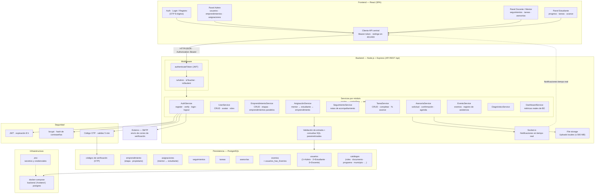

# Diagrama de Componentes — SGEMD

Sistema de Gestión de Emprendimiento Minuto de Dios. Diagrama de componentes
del MVP: frontend React, backend Node/Express, seguridad (JWT + bcrypt + OTP),
persistencia **PostgreSQL**, notificaciones en tiempo real (Socket.io),
almacenamiento de archivos (≤ 500 MB), servicio SMTP e infraestructura Docker.

## Diagrama (Mermaid)

Fuente: `README.md` del proyecto (roles, API, modelo de datos y arquitectura).

## Cómo llevarlo a draw.io (visual)

1. **Opción A — Importar PNG:** abre draw.io y arrastra `diagrama-componentes.png`
   dentro del lienzo, o *File → Insert from… → Image*.
2. **Opción B — Abrir el `.drawio` editable:** abre `diagrama-componentes.drawio`
   en draw.io desktop o en app.diagrams.net y edítalo con formas nativas.
3. **Opción C — Mermaid → draw.io online:** copia el bloque Mermaid de arriba a
   mermaid.live, exporta la imagen y arrástrala a draw.io.

## Archivos generados

| Archivo                       | Formato    | Uso                                       |
| ----------------------------- | ---------- | ----------------------------------------- |
| `diagrama-componentes.md`     | Markdown   | Diagrama en Mermaid (este documento)      |
| `diagrama-componentes.png`    | Imagen     | Vista visual (importable a draw.io)       |
| `diagrama-componentes.drawio` | XML/mxGraph| Editable directamente en draw.io          |