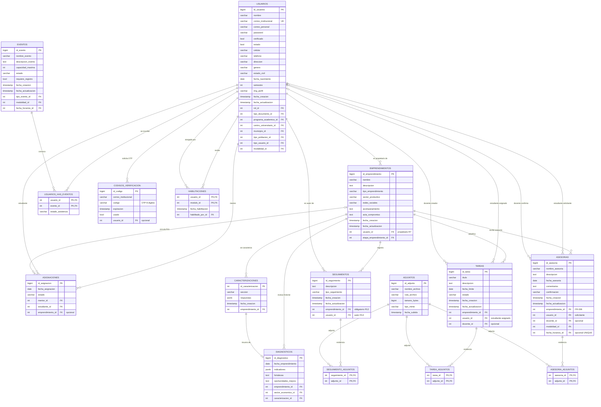

# Diagrama Entidad-Relacion - SGEMD

Sistema de Gestion de Emprendimiento Minuto de Dios. Diagrama entidad-relacion
del **modelo de datos objetivo** del MVP: 29 tablas con sus claves foraneas,
claves unicas y cardinalidades.

> **Complementa a `diagrama-clases.md`, no lo reemplaza.** El diagrama de clases
> muestra *como se estructura el negocio por dentro* (atributos, visibilidad,
> metodos). El entidad-relacion muestra *como se persiste*: que tablas existen,
> como se unen y con que multiplicidad. Junto con `component-diagram.mmd` y
> `context-diagram.mmd` completan la familia de diagramas del MVP.

## Procedencia y metodo

| Aspecto | Detalle |
| ------- | ------- |
| **Fuente de verdad** | `README.md` §5 *Modelo de datos* y §6 *Reglas de negocio* (PostgreSQL 17) |
| **Corregido con** | `docs/diagrama-clases.md`, `docs/fr_nfr_sgemd.md`, `docs/historias_usuario.md` |
| **Herramienta** | Mermaid (`erDiagram`) + draw.io |
| **Validacion** | 29 tablas y 42 relaciones; 16 tablas de negocio con comportamiento y 13 catalogos de lectura |

**Decision de diseno:** los nombres de las tablas y columnas son los que debe usar
el `schema.sql`. Se normalizaron a **snake_case**, que es lo que el propio
`README.md` §10 exige y lo que el motor exige en PostgreSQL, donde los
identificadores sin entrecomillar se pliegan a minusculas.

---

## Diagrama (Mermaid)

### Entidades de negocio (16 tablas)

### Catalogos (13 tablas de lectura)

Se listan aparte porque **no tienen comportamiento**: solo aportan una clave
foranea. Modelarlos todos en el diagrama principal anade cajas que no aportan
informacion y deja ilegibles las que si la aportan.

```mermaid
erDiagram
    USUARIOS {
        bigint id_usuarios PK
    }
    EMPRENDIMIENTOS {
        bigint id_emprendimiento PK
    }
    ASESORIAS {
        bigint id_asesoria PK
    }
    DIAGNOSTICOS {
        bigint id_diagnostico PK
    }
    EVENTOS {
        bigint id_evento PK
    }
    HABILITACIONES {
        int usuario_id PK,FK
        int modulo_id PK,FK
    }

    ROLES {
        int id_roles PK
        varchar nombre
    }
    TIPO_DOCUMENTOS {
        int id_tipo_documento PK
        varchar nombre
    }
    PROGRAMA_ACADEMICO {
        int id_programa_academico PK
        varchar nombre
    }
    CENTRO_UNIVERSITARIOS {
        int id_centro_universitario PK
        varchar nombre
    }
    MUNICIPIOS {
        int id_municipio PK
        varchar nombre
    }
    TIPO_POBLACION {
        int id_tipo_poblacion PK
        varchar nombre
    }
    TIPO_USUARIOS {
        int id_tipo_usuario PK
        varchar nombre
    }
    ETAPA_EMPRENDIMIENTO {
        int id_etapa_emprendimiento PK
        varchar tipo_etapa
    }
    SECTOR_ECONOMICO {
        int id_sector_economico PK
        varchar nombre
    }
    MODALIDAD {
        int id_modalidad PK
        varchar nombre
    }
    TIPO_EVENTO {
        int id_tipo_evento PK
        varchar nombre
    }
    FECHA_HORARIOS {
        int id_fecha_horarios PK
        date fecha
        time hora_inicio
        time hora_fin
    }
    MODULOS {
        int id_modulo PK
        varchar nombre
    }

    ROLES ||--o{ USUARIOS : rol
    TIPO_DOCUMENTOS ||--o{ USUARIOS : documento
    PROGRAMA_ACADEMICO ||--o{ USUARIOS : programa
    CENTRO_UNIVERSITARIOS ||--o{ USUARIOS : campus
    MUNICIPIOS ||--o{ USUARIOS : municipio
    TIPO_POBLACION ||--o{ USUARIOS : poblacion
    TIPO_USUARIOS ||--o{ USUARIOS : "tipo de usuario"
    MODALIDAD ||--o{ USUARIOS : modalidad
    ETAPA_EMPRENDIMIENTO ||--o{ EMPRENDIMIENTOS : "etapa R17"
    SECTOR_ECONOMICO ||--o{ DIAGNOSTICOS : "sector economico"
    MODALIDAD ||--o{ ASESORIAS : modalidad
    FECHA_HORARIOS o|--o{ ASESORIAS : "ocupa bloque UNIQUE"
    TIPO_EVENTO ||--o{ EVENTOS : "tipo de evento"
    MODALIDAD ||--o{ EVENTOS : modalidad
    FECHA_HORARIOS ||--o{ EVENTOS : "fecha y hora"
    MODULOS ||--o{ HABILITACIONES : modulo
```

| Catalogo | PK | Se usa en |
| -------- | -- | --------- |
| `roles` | `id_roles` | `usuarios` (1:N) — 1=Admin, 2=Estudiante, 3=Docente |
| `tipo_documentos` | `id_tipo_documento` | `usuarios` (tipo de documento) |
| `programa_academico` | `id_programa_academico` | `usuarios` (semestre / carrera) |
| `centro_universitarios` | `id_centro_universitario` | `usuarios` (campus) |
| `municipios` | `id_municipio` | `usuarios` (municipio de residencia) |
| `tipo_poblacion` | `id_tipo_poblacion` | `usuarios` (poblacion vulnerable) |
| `tipo_usuarios` | `id_tipo_usuario` | `usuarios` (Estudiante/Egresado/Docente/Administrativo) |
| `modalidad` | `id_modalidad` | `usuarios`, `asesorias`, `eventos` |
| `etapa_emprendimiento` | `id_etapa_emprendimiento` | `emprendimientos` — catalogo cerrado de 4 etapas (R17) |
| `sector_economico` | `id_sector_economico` | `diagnosticos` |
| `tipo_evento` | `id_tipo_evento` | `eventos` |
| `fecha_horarios` | `id_fecha_horarios` | `asesorias` (0..1), `eventos` (1:N) |
| `modulos` | `id_modulo` | `habilitaciones` — no se enlaza directo a `usuarios` |

---

## Correcciones aplicadas

El diagrama no se limitó a copiar el `README.md` §5. Al cotejarlo contra
`fr_nfr_sgemd.md` y `historias_usuario.md` aparecieron cinco problemas del
modelo, todos resueltos aquí. Estan marcados en morado en el `.drawio`.

| # | Problema | Correccion | Regla / requisito que obliga |
| - | -------- | ---------- | ---------------------------- |
| 1 | `asesorias` no tiene relacion con `emprendimiento`. El expediente central no puede incluir las asesorias. | `asesorias.emprendimiento_id` + relacion `emprendimientos 1:N asesorias`. | FR-006: anclar diagnosticos, seguimientos, tareas **y asesorias** al emprendimiento, para que el mentor nuevo vea el contexto. |
| 2 | No existe entidad para las respuestas del formulario de caracterizacion, solo el resultado. | Nueva tabla `caracterizaciones` (1:N por emprendimiento), consumida por `diagnosticos.caracterizacion_id`. | FR-002: el estudiante diligencia el formulario y el sistema calcula metricas. Sin el insumo no se puede recalcular ni auditar. |
| 3 | `fecha_horarios` esta declarado `1:N` en catalogos pero se usa como `0..1` en asesorias, y nada impide el doble booking. | `asesorias.fecha_horarios_id` queda `0..1` y se marca **UNIQUE**. | BR-002: prevencion de duplicidad con propiedades ACID. |
| 4 | `usuarios.Modulos_idModulos` no puede modelar el desbloqueo progresivo por estudiante; controla por rol, no por persona. | Se separa en catalogo `modulos` + pivote `habilitaciones(usuario_id, modulo_id, fecha_habilitacion, habilitado_por_id)`. | AQ-02 (prioridad alta): el estudiante se registra pero el administrador debe habilitarle el resto de la plataforma **individualmente**. |
| 5 | FR-008 exige subir, descargar y **borrar el archivo del servidor**, pero no hay entidad donde registrarlo. | `adjuntos` + tres pivotes (`seguimiento_adjuntos`, `tarea_adjuntos`, `asesoria_adjuntos`). | FR-008 + criterio de aceptacion 7: los adjuntos se eliminan del servidor si se borra la tarea. Sin entidad no hay forma de garantizarlo. |

### Nomenclatura: snake_case

El `README.md` §10 exige usar una convencion consistente en snake_case, pero su
propio §5 la incumple: mezcla `idUsuarios` (camelCase), `Fecha_asesoria`
(snake_case) y `idFecha_y_Horarios`. Este diagrama aplica la regla, que ademas es
lo que PostgreSQL impone sobre identificadores sin entrecomillar.

| `README.md` §5 (heredado) | Corregido |
| ------------------------- | --------- |
| `Roles_idRoles1` | `rol_id` |
| `Usuarios_idUsuarios` | `usuario_id` |
| `tipodocumentos` | `tipo_documentos` |
| `programaacademico` | `programa_academico` |
| `centrouniversitarios` | `centro_universitarios` |
| `tipopoblacion` | `tipo_poblacion` |
| `tipousuarios` | `tipo_usuarios` |
| `etapaemprendimiento` | `etapa_emprendimiento` |
| `sectoreconomico` | `sector_economico` |
| `fecha_y_Horarios` | `fecha_horarios` |
| `codigosverificacion` | `codigos_verificacion` |
| `idSeguimientos`, `idTareas`, `idAsesorias` | `id_seguimiento`, `id_tarea`, `id_asesoria` |

> **Discrepancia abierta:** el `README.md` §5 dice que los codigos de
> verificacion se relacionan con el usuario **por correo**
> (*"varios codigos pueden corresponder a un usuario (por correo)"*). Este
> diagrama agrega `codigos_verificacion.usuario_id`, mas robusto y coherente con
> el resto del modelo. La tabla de §5 todavia no lo refleja.

## Tablas excluidas

| Tabla | Motivo |
| ----- | ------ |
| `evaluacioneshabilidades` | La evaluacion de habilidades no esta implementada en el flujo principal del MVP. |
| `solicitudestutoria` | Duplica la funcionalidad que ya cubre `asesorias`. |

---

## Trazabilidad: regla → tabla

| Regla / requisito | Tablas que lo soportan |
| ----------------- | ---------------------- |
| R4-R8 Emprendimientos y su propietario | `emprendimientos`, `usuarios`, `etapa_emprendimiento` |
| R9-R11 Asignaciones (max 1 activa por emprendimiento) | `asignaciones` con cardinalidad `o|--o{` |
| R12-R16 Seguimiento y autor obligatorio | `seguimientos` (`emprendimiento_id` + `usuario_id` ambos obligatorios) |
| R17 Catalogo cerrado de 4 etapas | `etapa_emprendimiento.tipo_etapa` |
| R18-R21 Tareas, estados y avance derivado | `tareas.estado`, `tareas.fecha_limite` |
| R22-R23 Asesorias solicitadas y confirmadas | `asesorias.confirmacion`, `fecha_horarios_id UNIQUE` |
| FR-008 Archivos adjuntos (max 500 MB) | `adjuntos.tamano_bytes` + 3 pivotes |
| AQ-02 Habilitacion por persona | `habilitaciones` |
| FR-002 Diagnostico | `diagnosticos`, `caracterizaciones`, `sector_economico` |
| FR-005 Eventos y asistencia | `eventos`, `usuarios_has_eventos`, `tipo_evento` |

---

## Como llevarlo a draw.io (visual)

1. **Opcion A — Abrir el `.drawio` editable:** abre `diagrama-entidades.drawio`
   en draw.io desktop o en app.diagrams.net. Ya viene con las 29 tablas en dos
   compartimentos (entidades de negocio y catalogos), las 42 relaciones con
   cardinalidades, y una leyenda con las correcciones aplicadas.
2. **Opcion B — Importar el PNG:** arrastra `diagrama-entidades.png` al lienzo,
   o *File → Insert from… → Image*.
3. **Opcion C — Mermaid → draw.io:** copia el bloque Mermaid de este documento a
   mermaid.live, exporta la imagen y arrastrala.

> El bloque Mermaid de este `.md` **es la fuente de verdad**: es texto, se
> versiona en Git, se revisa con `diff` y lo puede regenerar cualquier
> herramienta de IA. El PNG y el `.drawio` son derivados. Por eso el PNG nunca
> se sube sin el `.md` que lo explica.

## Archivos generados

| Archivo                  | Formato     | Uso                                           |
| ------------------------ | ----------- | --------------------------------------------- |
| `diagrama-entidades.md`  | Markdown    | Diagrama en Mermaid + trazabilidad (este documento) |
| `diagrama-entidades.png` | Imagen      | Vista visual para el informe y el repositorio |
| `diagrama-entidades.drawio` | XML/mxGraph | Editable directamente en draw.io            |
